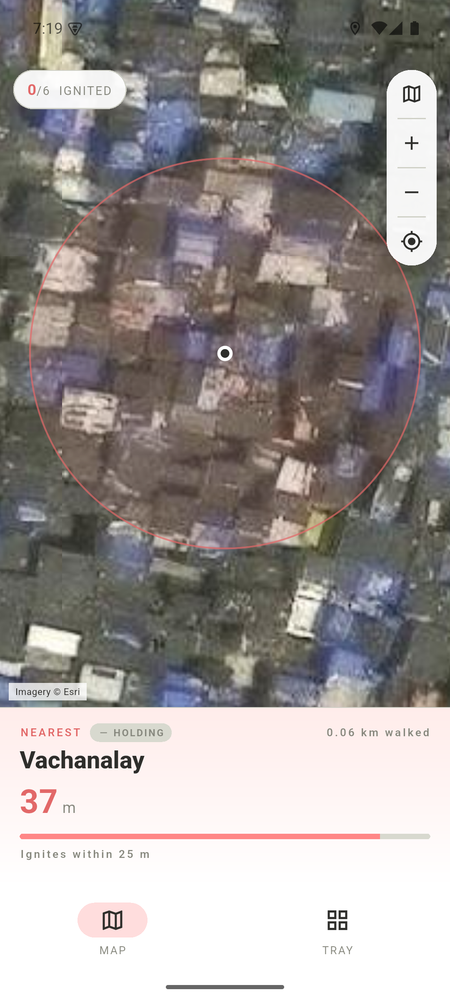
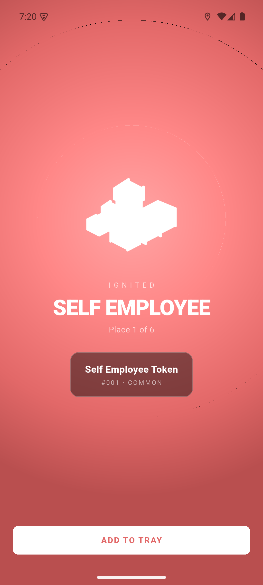
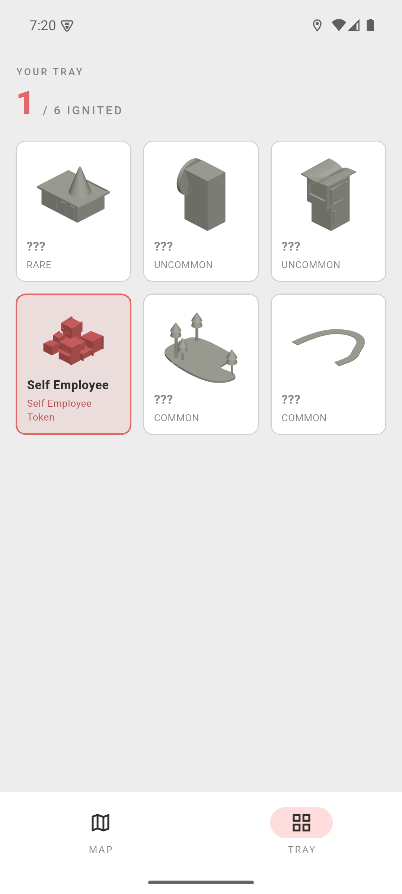
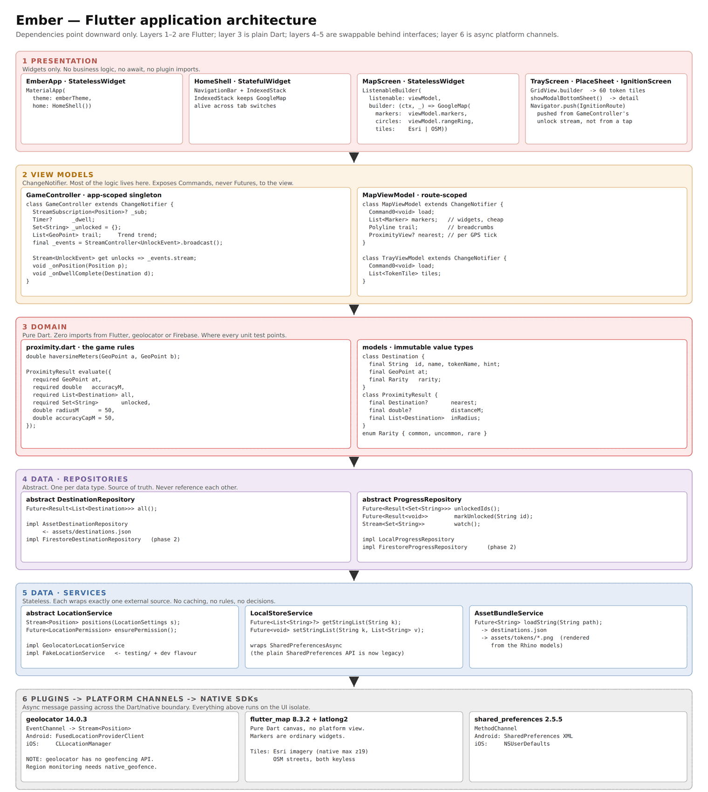
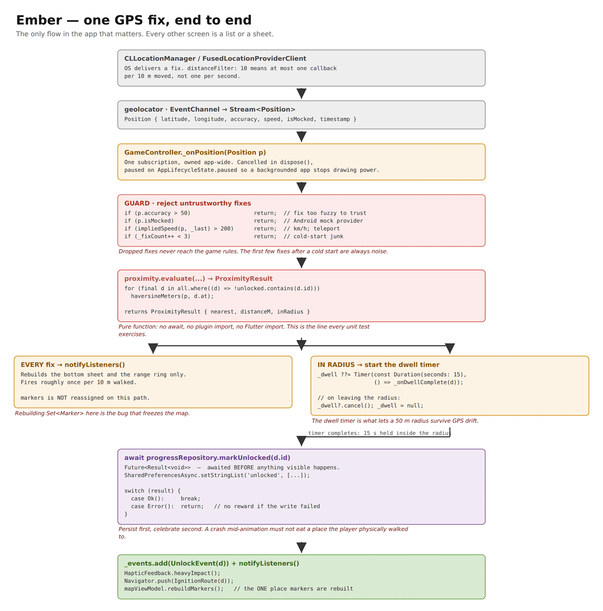

# Ember

A walk-and-unlock map game for surveying a neighbourhood on foot. Places start
cold. Walk within 25 metres of one, hold position for fifteen seconds, and it
ignites: you win a named token and your route is drawn on the map behind you.

<p align="center">
  
  
  
</p>

## Status

Working MVP. Six surveyed places, on-device progress, no backend and no
accounts. Signed test builds are published under
[Releases](../../releases).

## Running it

```bash
flutter pub get
flutter run
```

No API key, no billing account, no signup. The map draws Esri satellite imagery
by default with an OpenStreetMap street layer behind a toggle.

### Testing without walking outside

The emulator's extended controls (`...` → Location) set a position and
`geolocator` reads it, so the whole loop can be driven from a desk. Put a point
within 25 m of one of the entries in `assets/destinations.json` and hold for
fifteen seconds.

`FakeLocationService` in `lib/data/location_service.dart` does the same thing
from a test or a debug build.

## Architecture



Layers depend downward only. `lib/domain/` is plain Dart with no imports from
Flutter, geolocator or the map, which is why the game rules are testable
without a device.

```
lib/
  domain/    models.dart, proximity.dart   <- the game. pure. fully tested.
  data/      location_service.dart, repositories.dart
  ui/        game_controller.dart, map_screen.dart, tray_screen.dart,
             ignition_screen.dart
  theme/     ember_theme.dart
assets/      destinations.json, tokens/
tools/       gen_token_art.py   <- renders token sprites from the Rhino models
             gen_icon.py        <- draws the launcher icon
             demo_walk.py       <- drives emulator GPS through every place
             record_demo.sh     <- records the walkthrough to an mp4
test/        proximity_test.dart
```

The one flow that matters:



## Four decisions worth knowing

**The radius is 25 m because the places are close together.** The tightest pair
is 39 m apart, so anything at or above that would put a player inside two zones
at once and hand out both tokens from one spot. This is a squeeze rather than a
free win: urban GPS runs 7–13 m and worse where the sky view is blocked, so the
radius sits near the noise floor and wants checking on the ground. Fixes vaguer
than the radius are discarded rather than trusted.

**The dwell timer is not decoration.** A bare radius flickers as GPS drifts, so
a place only ignites once the player has stayed inside it for fifteen seconds.
That also filters drive-bys and makes spoofing cost real time.

**OpenStreetMap instead of Google Maps.** Google's mobile map SKU is free and
unlimited, but issuing a key still requires attaching a billing account.
`flutter_map` over public tiles avoids that, and markers become ordinary Flutter
widgets rather than bitmaps marshalled across a platform channel. The trade-off
is real: these tile services carry no uptime guarantee and forbid bulk or
offline fetching, so anything with real users needs its own tile source.

**Imagery detail is capped by the free source, not by the app.** Esri serves
the survey area to zoom 19, roughly 28 cm per pixel, and returns blank tiles
above it. Past that the layer upscales, so the picture grows without gaining
detail. Lane-level clarity is not reachable from free sources at all: the lanes
are absent from every street map tested as well, which is why routing detours
over a kilometre around a seventy-metre gap.

Supplying a Mapbox token swaps in imagery with native tiles to zoom 22 over
cities, and raises the zoom ceiling to match:

```bash
flutter build apk --release --dart-define=MAPBOX_TOKEN=pk.your_token
```

Without it the app falls back to Esri and behaves exactly as before. The
attribution follows whichever source is in use.

## Token art

The tokens are rendered from Rhino models, one file per place:

```bash
python3 -m venv .venv-3dm && .venv-3dm/bin/pip install rhino3dm pillow numpy
.venv-3dm/bin/python tools/gen_token_art.py ../tokens
```

Flutter cannot draw `.3dm`, and a 3D engine would be a heavy dependency for six
small pictures, so each model is rasterised once to a flat-shaded sprite in the
palette, in a lit and a cold variant. `tools/gen_icon.py` draws the launcher
icon from the same palette.

## Recording a walkthrough

```bash
adb devices                       # emulator must be running
bash tools/record_demo.sh demo    # SPEEDUP=6 by default
```

Resets progress, walks every place at 1 m/s so the app sees a believable GPS
cadence, and stitches the screen recording into `demo.mp4` at six times speed.
The walk takes about nine minutes and yields roughly ninety seconds of video.

The route is a smooth curve through the surveyed places rather than straight
lines. Real road routing was tried and rejected: the lanes are not in
OpenStreetMap, and OSRM detours over a kilometre around a seventy-metre gap.

## Building a release APK

```bash
flutter build apk --release
```

Signing comes from `android/key.properties`, pointing at a keystore kept outside
the repo. Both are gitignored, and without them the build falls back to debug
keys, which installs but cannot be updated in place by a differently-signed
build. **Back up the keystore**; losing it means testers must uninstall before
taking another build.

## Tests

```bash
flutter test
```

Covers the haversine maths, the fix-rejection guards (accuracy cap, mock
provider, teleport detection, cold-start warmup), the radius boundary, and the
nearest-first ordering that stops a cluster of close places awarding the wrong
token.

## Licence

Not yet chosen.
