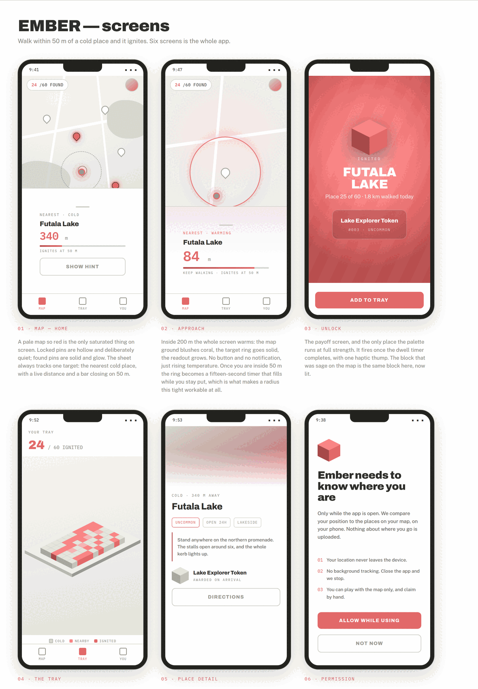

# Ember

A walk-and-unlock map game. Every place in the city starts cold. Walk within
50 metres, hold position for fifteen seconds, and it ignites: the marker turns
red, you win a named token, and it joins your tray.



## Status

Working MVP skeleton. The map, the proximity engine, the dwell timer, the
unlock moment and the token tray all run. Progress is stored on the device.
No backend, no accounts.

The demo set covers **Prem Nagar, Goregaon West, Mumbai**: a 4x4 grid of 16
points at 140 m spacing, spanning roughly 420 m square, generated by
`tools/gen_destinations.py`. Rarity increases with distance from the centre, so
the edges of the area are worth the walk.

These are geometric grid points laid out around the neighbourhood anchor, not
surveyed positions. Walk them and correct the coordinates in
`assets/destinations.json`, or retune `SPACING_M` and the grid size and
re-run the generator.

## Running it

```bash
flutter pub get
flutter run
```

No API key, no billing account, no signup. The map draws OpenStreetMap tiles
through `flutter_map`, desaturated so the red markers are the only saturated
thing on screen.

### Testing without walking outside

The emulator's extended controls (`...` → Location) set a position, and
`geolocator` reads it, so the whole loop is demonstrable at a desk. Set a point
within 50 m of one of the destinations in `assets/destinations.json` and hold
for fifteen seconds. The grid centre is `19.1718491, 72.8382547`.

`FakeLocationService` in `lib/data/location_service.dart` does the same thing
from a test or a debug build.

## Architecture


Layers depend downward only. `lib/domain/` is plain Dart with no imports from
Flutter, geolocator or Google Maps, which is why the game rules are testable
without a device.

```
lib/
  domain/      models.dart, proximity.dart   <- the game. pure. fully tested.
  data/        location_service.dart, repositories.dart
  ui/          game_controller.dart, map_screen.dart, tray_screen.dart,
               ignition_screen.dart
  theme/       ember_theme.dart
assets/        destinations.json
tools/         gen_destinations.py   <- regenerates the coverage grid
test/          proximity_test.dart
```

The one flow that matters:


## Two decisions worth knowing

**The dwell timer is not decoration.** A 50 m radius is tighter than anything
shipped in this genre (Pokémon GO uses 80 m, Munzee 90 m) and tighter than
Android's documented 100–150 m minimum for geofences. Urban GPS drifts 7–13 m,
so a bare radius flickers. Requiring the player to stay inside it for fifteen
seconds is what makes the radius workable, and it also filters drive-bys and
makes spoofing cost real time.

**OpenStreetMap instead of Google Maps.** Google's mobile map SKU really is
free and unlimited, but issuing a key still requires attaching a billing account
to the project. `flutter_map` over OSM tiles avoids that entirely, and markers
become ordinary Flutter widgets rather than bitmaps marshalled across a platform
channel.

The trade-off is real and worth writing down: OSM's public tile server has no
SLA, forbids bulk and offline fetching, and asks for a User-Agent identifying
the app (set in `map_screen.dart`). That is fine for development and a small
demo. Anything with real users needs its own tile source — a self-hosted
Protomaps extract, or a paid provider — or a switch back to Google with a key.

## Tests

```bash
flutter test
```

Covers the haversine maths, the fix-rejection guards (accuracy cap, mock
provider, teleport detection) and the radius boundary.

## Docs

- [`docs/PLAN.md`](docs/PLAN.md) — the non-technical plan
- [`docs/ember_screens.png`](docs/ember_screens.png) — all six screens
- [`docs/arch_layers.png`](docs/arch_layers.png) — layer architecture
- [`docs/arch_flow.png`](docs/arch_flow.png) — one GPS fix, end to end

## Licence

Not yet chosen.
