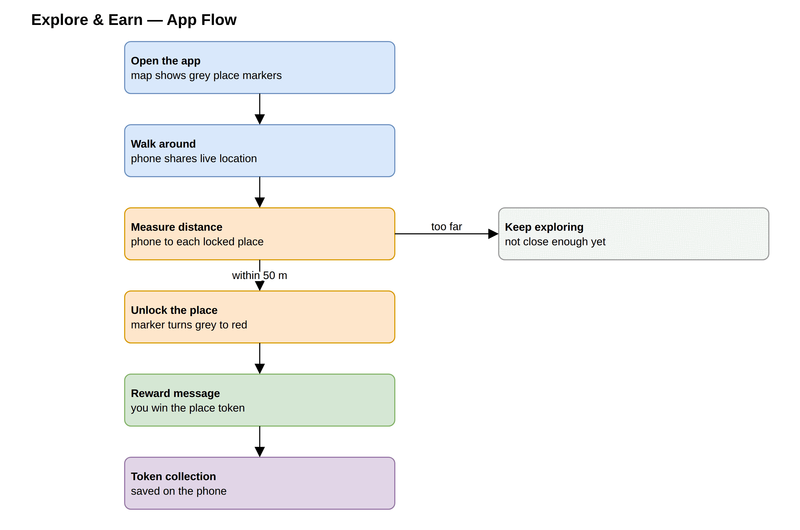
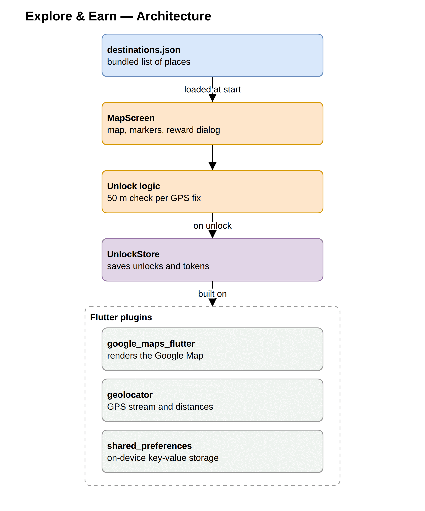

# Explore & Earn app plan

The pitch: a mobile game that rewards people for exploring their city. The app shows a Google Map dotted with grey markers, each one a real place worth visiting. Walk within 50 metres of one and it unlocks: the marker turns red, a message pops up ("You unlocked Futala Lake! You win a Lake Explorer Token"), and the token joins your collection. The more you explore, the more you earn.

## How it works

> Editable source: `app_flow.drawio` (open at [app.diagrams.net](https://app.diagrams.net)) · slide-ready image: [app_flow.png](app_flow.png)

In one sentence: the app watches how far you are from each locked place, and the moment you get within 50 metres of one, it celebrates and rewards you.

## What we build first (the MVP)

A deliberately small first version that is still a complete, demoable game:

| Included | Deferred to later |
|---|---|
| Live Google Map with your position | User accounts / login |
| Grey markers for every destination | Online backend (places ship inside the app for now) |
| Automatic unlock within 50 m | Unlocks while the app is closed |
| Reward pop-up + marker turns red | Anti-cheat (fake GPS detection) |
| Token collection saved on the phone | Trading or redeeming tokens |

Tokens in the MVP are in-app collectibles (a name and a count), not cryptocurrency.

## Technology

| Piece | What it is | Why |
|---|---|---|
| Flutter | Google's app framework | One codebase produces both the Android and iOS app |
| Google Maps plugin | Official map component | The familiar Google Maps look, markers, and camera |
| Location plugin | GPS access | Streams the phone's position and measures distance to each place |
| On-device storage | Small local database | Remembers unlocked places and won tokens between sessions |

Just three add-on packages on top of Flutter, with no custom servers of our own. Google Maps needs a Google Cloud account for the map key. Google replaced its flat monthly credit in February 2025 with per-product free allowances, so confirm the current mobile map-load allowance on the billing page before any wide distribution. At the scale this app starts at, it sits inside the free allowance comfortably, and an open-source map source is available as a fallback if that ever changes.

## Build timeline

Roughly two weeks for a first-time Flutter developer, in four steps. Each step ends with something you can show:

| Step | What gets built | Time | You can demo |
|---|---|---|---|
| 1. Setup | Project created, Google Maps key, location permissions | about a day | App opens on a phone |
| 2. The map | Live map centred on the city, grey markers loaded from the places list | 1 to 2 days | Yourself and grey pins on a real map |
| 3. The game | Distance checking, unlock moment, reward message, saving progress | 2 to 3 days | Walk to a place and watch it unlock (this is the MVP) |
| 4. Polish | "My tokens" collection screen, visible 50 m circles around locked places, celebration effects | 2 to 3 days | The full game loop, presentable |

## Things to know

- A 50 m radius is the sweet spot. Phone GPS is accurate to roughly 5 to 20 metres outdoors, and a much tighter radius makes unlocks unreliable near buildings. The app also ignores low-quality GPS readings, so nobody unlocks a place from indoors by accident.
- The app is gentle on the battery. It only re-checks distances after the phone has moved about 10 metres, rather than constantly polling GPS.
- Test on a real phone. Emulators can fake a location, which helps during development, but the walk-up-and-unlock feel only shows on a device.
- Adding places is trivial. Destinations are a plain list (name, coordinates, token name) bundled with the app, so anyone can add a new place without touching app logic.

## Future roadmap (only if the app takes off)

1. An online backend (Firebase), so places and player progress live in the cloud. New destinations would appear without an app update, and players would get accounts.
2. Background unlocks, so players get notified when they pass a destination even with the app closed. Phone operating systems make this genuinely hard, so it waits until players ask for it.
3. Anti-cheat. Once tokens have real value, the server should verify each claim and detect fake GPS apps.

## Appendix: architecture (for developers)

Four small pieces of app code sitting on three off-the-shelf Flutter plugins:

> Editable source: `app_architecture.drawio` · slide-ready image: [app_architecture.png](app_architecture.png)
